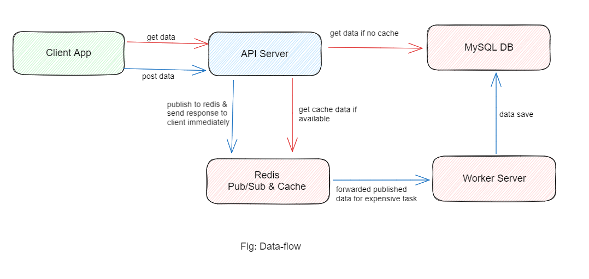

### Redis Microservice Architecture

### Project Description

This project workspace consists of a client-app, api-server, and worker-server, showcasing a Redis cache and Redis publish-worker architecture. The client-app communicates with the api-server to retrieve data, which is then cached using Redis for faster subsequent access. The worker-server listens for incoming messages via Redis publish-subscribe mechanism and performs background tasks based on those messages. With Redis acting as a high-performance data store and messaging system, this project demonstrates an efficient and scalable architecture for caching and background processing in a distributed application environment.

### Project structure

The project is structured as a monorepo and includes the following micro-peojects:

- `client-app`: The client app built with Next.js and Tailwind CSS.
- `api-server`: The api server build with Node.js, Mysql database
- `worker-server`: The subscribed worker-server with redis and Mysql database.

### Installation and Run

Installing the project is easy and straight forward. If you're using npm, simply run the following command in your terminal from every project's root:

If you're using npm, the command will be to install:

```sh
npm install
```

And the following command to run:

```sh
npm run dev
```

**Note: Please add all the environment variables from the "example.env" file added to each project**

### Data-flow Diagram

<figure > 
<p align="center">
  
</p>
</figure>

### Explanation

- In this project architecture, the `client-app` serves as the primary frontend application, communicating with the `api-server` via API calls to a MySQL database.

- When a GET request is sent to the `api-server`, it first checks the Redis cache for relevant data. If the cache contains the data, the `api-server` responds promptly to the `client-app` without querying the database, resulting in faster response times. However, in cases where the cache is empty, the `api-server` queries the database, retrieves the data, and caches it in Redis for future use.

- For POST requests that involve data creation, the `api-server` publishes a message to the Redis pub/sub system and immediately responds positively to the client. The `worker-server`, which is subscribed to the Redis pub/sub, receives this message. It performs the necessary operations related to the request and finally stores the data in the database. This asynchronous processing allows the `api-serve`r to quickly acknowledge the client's request while the `worker-server` handles the background tasks efficiently
